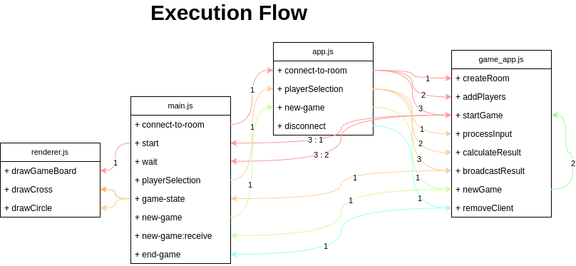
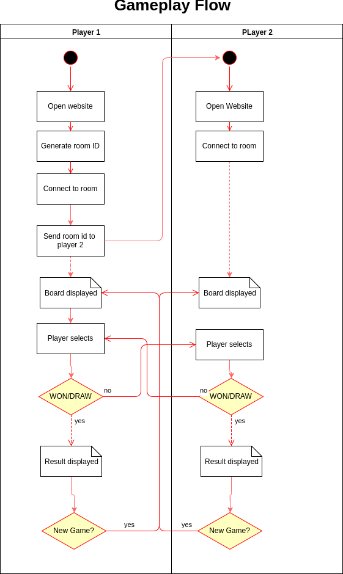

# IMPLEMENTATION
Being a multi-player room-based game over the internet, this game has two major sections: Frontend and Backend. 

## Backend
Backend has two important sections. The network layer and the Game Logic Layer.

The network layer is responsible for the connection between the browser and the client.
Two types of network connections are used:
* HTTP
    * HTTP is used to serve index.html and static files (images, javascript, css etc.)
* WebSocket
    * WebSocket is used to maintain the duplex connection between the server and the client. 
    * All the messages (during the game-play) from the browser are sent over the WebSocket.
    * All the messages from the server to update the browser are also sent over the WebSocket.

### Structure
The backend is divided mainly in two files:
#### app.js
This file is responsible for the network layer.

This file serves the index.html file and servers the static files using express.js.

Static files are served using ExpressJS's static middleware.

WebSocket server waits for the connection from the browser and setups the callbacks for different type of message events.

##### Events:
* `connect-to-room`
    * When a "connect-to-room" message comes from the browser we do these things in order:
      * Create a room with the room id provided if the room is not created.
      * Adds the current socket connection as a player to the room.
      * If the player is added successfully, start the game.
* `playerSelection`
    * When "playerSelection" message comes from the browser we do these things in order:
    * Forward the selection to game_app to further process the input and update the game state.
    * Calculate the result of the game (meaning whether the game has resulted into a win/draw).
    * Triggers the broadcast of the game state to all the connected players.
* `new-game`
    * Forwards the new-game message to the game layer which clears the previous game data and initializes the game state.
* `disconnect`
    * Triggers these changes:
        * Remove the player from all the rooms the socket belongs to.
#### game_app.js
`gameServer` - This is the main global variable which encompasses everything.
* `gameServer.gameRoom` - contains all the rooms based on the room-id as the key
* `gameServer.createRoom`
    * This function creates the room based on roomId, if the room does not exist.
* `gameServer.addPlayers`
    * Takes two arguments: roomId, player(socket)
    * Connects the player as "player1" or "player2" in that order.
    * Emits a "room-full" message if the room already have both players to the new player who is trying to add.
* `gameServer.startGame`
    * If both players are not connected send the "wait" message to the player who is connecting.
    * If both players are connected:
        * Update the game state
        * Reset the game board
        * Send the start event with the board
* `gameServer.processInput`
    * Takes two arguments: roomId, selection
    * Fetches the room based on roomId
    * Sets the selection to the board with the constant of the user who made the selection
        * 1 for player1
        * 2 for player2
    * Changes the player turn by toggling the flag firstPlayerTurn
* `gameServer.calculateResult`
    * Fetches the room
    * Resets the game state and result
    * Calculates the game result and state
        * Checks for all the possible combinations for each players and sets the state and player_won accordingly.
        * If no player won then checks the if the match is draw and sets the game state accordingly.
* `check_draw`
    * Helper function which return true|false based on whether the all the cells of the board are filled or not
* `gameServer.broadcastResult`
    * Sends/broadcasts the state of the game to both players
        * Format of the broadcast:
             {
                "playerTurn": <true|false>, // Whether it is the player's turn
                "board": [[], [], []], // 2D array containing the entire board
                "state": <ready|waiting|won|in_progress|draw>, // Represent the state of the game
                "playerWon": <true|false>, // If the game state is 'won', this value represents who won the game
             }
* `gameServer.newGame`
    * Resets the board
    * Emits the 'new_game' message to both players
    * Resets the state
    * Starts the game
* `gameServer.removeClient`
    * Takes a player/socket as an argument
    * Removes the player from the room
    * If other player is still connected, sends the 'end-game' message to the other player.

## Frontend
Frontend makes use of HTML5 Canvas api to draw the pixels that the user sees as the game board. Canvas is used in 2D context.

Frontend has 4 main sections:
* index.html (HTML)
* main.js
* renderer.js
* ui.js

### index.html
This contains all the elements of the UI.

UI Elements:
* room-links
    * Used to display the room id
* roomForm
    * Contains the room id input and the room id generator button
*  waitingState
    * Initially hidden, This is used to show the waiting for other player info.
* endGame
    * This is the used to show the message when the game has ended because of other player leaving the game.
* gameState
    * Displays the current state of the game
* canvas
    * This is the main HTML5 Canvas on which the game board is drawn.
* turnMsg
    * Displays whether it is the user's turn or not.
* newGame
    * The "New Game" button appears when a game has finished, and gives the players a chance to start another game without reconnecting to the server.
* room-full
    * This is displayed to the user when the room is already full in which the user is trying to join.
### main.js
Connects the client to backend using WebSocket.
Provides these functionality 
* Sends the `connect-to-room` message on room form submission.
* Displays the "waiting" status on `wait` event.
* On `start` event:
    * Displays the canvas
    * Hides un-necessary elements
    * Triggers the draw of game board
* Handles `click` on the canvas
    * Calculates the position of the click event compared to the actual board.
    * If it is the player's turn sends the `playerSelection` message to the server.
* Listens for `game-state` message from the server
    * Triggers the display of user selection on the board.
    * Hide/Show the appropriate sections based on game state.
* Sends the `new-game` message to the server on `click` of "new-game" button.
* Hides the "new-game" button when the `new-game` message comes from the server.
* On `end-game` message, hides everything and displays "Waiting State"
* Displays the "room-full" on the `room-full` event from the server.
### renderer.js
renderer.js is responsible for actual draw on the canvas.
On complete load of the window does these:
Initialize some global variables
Sets the context of the canvas to 2D
Provides these functions:
* `drawGameBoard`
    * Clears the canvas
    * Draws the vertical and horizontal lines
* `drawCircle`
    * Takes the cell position and draws a circle in that cell using arc
* `drawCross`
    * Takes the cell position and draws a cross "X" in that cell
### ui.js
Contains the handles to all the UI elements (i.e. the dom elements)
Handles the click on the "generate room" button and generates a new room id.
Has a helper function `randomString` which generates a 12 digit random string.

## Game-play Flow
A typical game session looks like this:
* Player 1 opens the website.
* Player 1 generates a new room id.
* Player 1 connects to the room.
* Player 1 sends the room id to his/her friend and waits for his/her friend to join.
* Player 2 opens the website.
* Player 2 enters the room id given by the player 1.
* Player 2 connects to the room
* Player 1 sees that player 2 has connected and it is his/her turn.
* Player 1 makes his selection.
* Player 2 sees the Player 1's selection and makes his move.
* Player 1 sees the Player2's move and the game continues this way.
* Whenever either player has won or the game is in draw, the messages are displayed on both the player's screens.
* Now either of the player can start a new game by clicking on the "New Game"

If any player closes the website after joining the room, the other player will see the message that his/her opponent has left the room.

